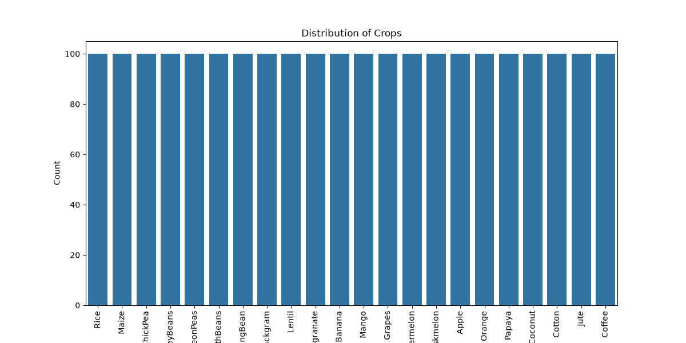
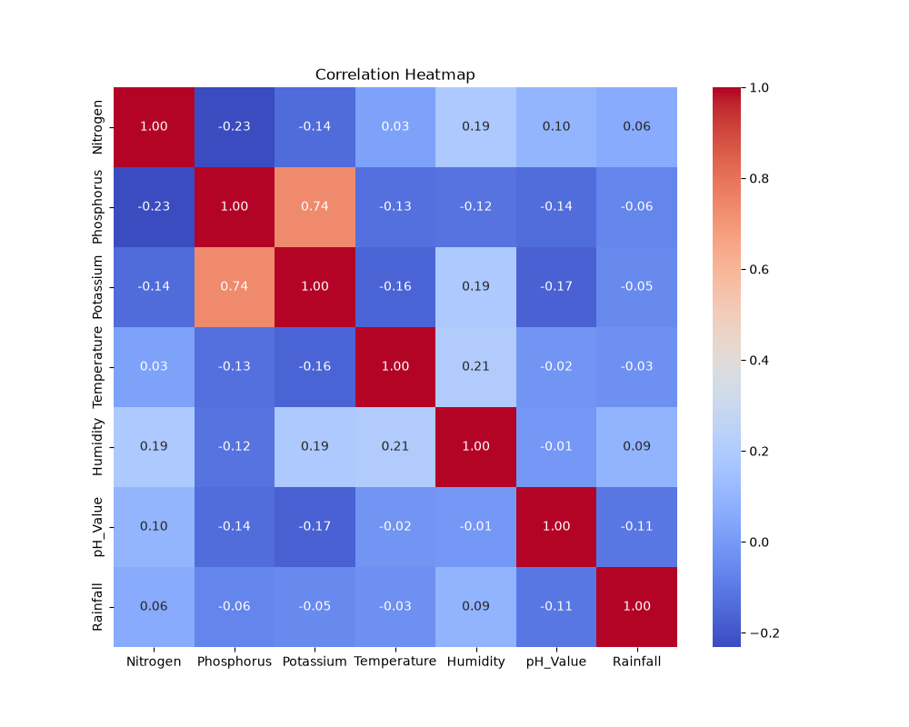
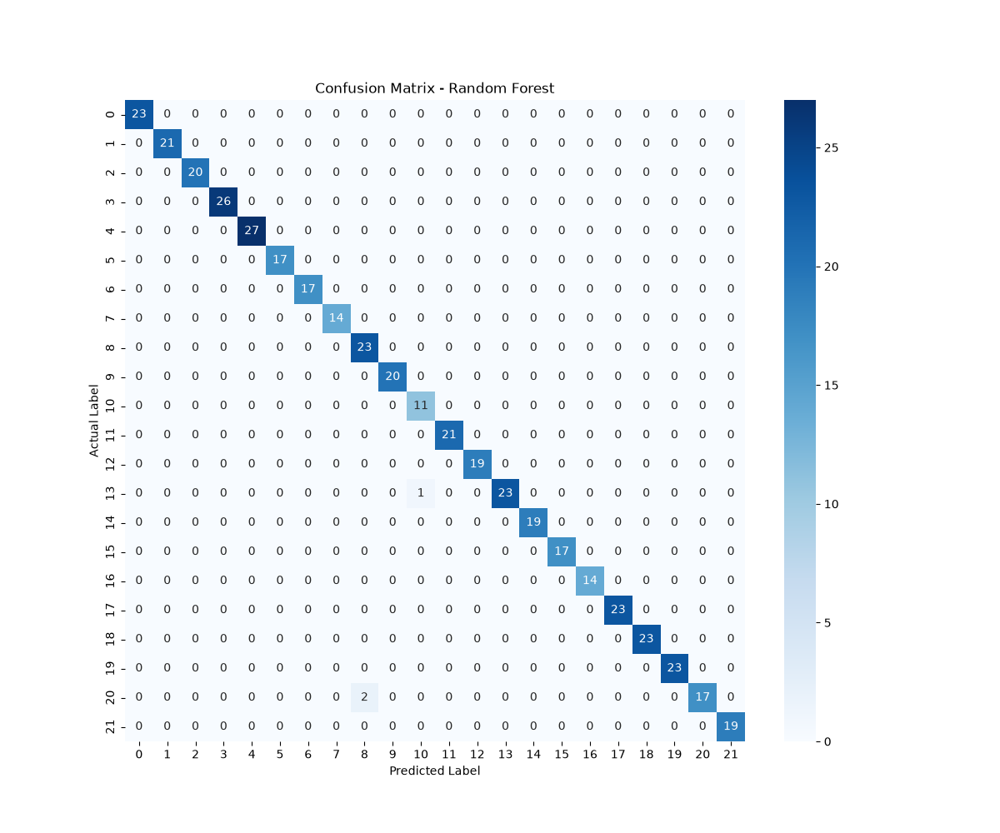

# 🌱 Smart Crop Recommendation System

A Machine Learning project that recommends the most suitable crop based on soil nutrients and environmental conditions.

---

## 📌 Project Overview

The Smart Crop Recommendation System helps farmers choose the most appropriate crop using machine learning techniques.

The prediction is based on the following input parameters:

- Nitrogen
- Phosphorus
- Potassium
- Temperature
- Humidity
- pH Value
- Rainfall

The project compares multiple Machine Learning algorithms and selects the best-performing model.

---

## 📂 Dataset

Dataset Name:

Crop Recommendation Dataset

Features:

- Nitrogen
- Phosphorus
- Potassium
- Temperature
- Humidity
- pH_Value
- Rainfall

Target Variable:

- Crop

Number of Records:

2200

Number of Features:

7

Number of Crop Classes:

22

---

## Exploratory Data Analysis (EDA)

The following visualizations were created:

## Project Visualizations

### Crop Distribution



### Correlation Heatmap



### Confusion Matrix


## 🤖 Machine Learning Models

The following models were implemented and compared:

| Model | Accuracy |
|--------|-----------|
| Decision Tree | 98.64% |
| K-Nearest Neighbors | 97.05% |
| Random Forest | 99.32% |

🏆 Best Model: **Random Forest Classifier**

---

## 📈 Model Evaluation

The model was evaluated using:

- Accuracy Score
- Confusion Matrix
- Classification Report

Final Accuracy:

**99.32%**

---

## 🛠 Technologies Used

- Python
- Pandas
- NumPy
- Matplotlib
- Seaborn
- Scikit-learn
- Joblib

---

## 📁 Project Structure

```
Smart-Crop-Recommendation-System/

│── dataset/
│ └── Crop_Recommendation.csv

│── images/
│ ├── crop_distribution.png
│ ├── correlation_heatmap.png
│ └── confusion_matrix.png

│── models/
│ ├── random_forest_model.pkl
│ └── label_encoder.pkl

│── notebooks/
│ └── Crop_Recommendation.py

│── app.py
│── requirements.txt
│── README.md
│── .gitignore
```

---

## ▶️ How to Run

Clone the repository

```
git clone <repository-url>
```

Install required packages

```
pip install -r requirements.txt
```

Run the application

```
python app.py
```

Enter the required values and the model will recommend the most suitable crop.

---

## 📌 Future Improvements

- Web application using Streamlit
- Weather API Integration
- Fertilizer Recommendation
- Real-time Prediction
- Mobile Application

---

## 👩‍💻 Author

**Simran**

Machine Learning Project
